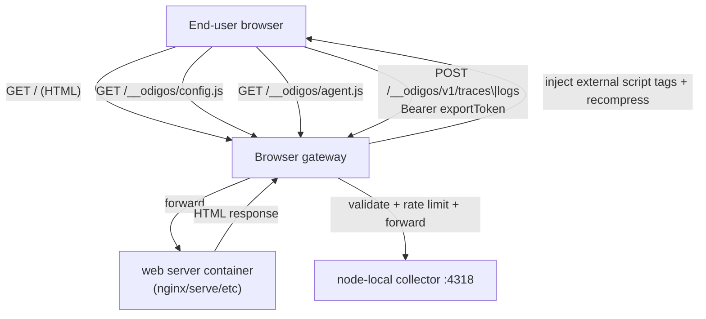

# opentelemetry-browser

Odigos browser (web) OpenTelemetry agent. This repo builds a single, self-contained
`agent.js` bundle based on the [OpenTelemetry JS Web SDK](https://opentelemetry.io/docs/languages/js/getting-started/browser/)
and packages it into a minimal container image that the Odigos `odiglet` pulls into its
agents image (exposed at `/instrumentations/browser/agent.js`, mounted on nodes at
`/var/odigos/browser`).

Unlike Odigos' server-side agents (PHP, Ruby, Node.js, ...), the browser agent does not run
inside the pod. It runs in the **end user's browser**. Odigos delivers it via a **hardened
same-origin gateway** (`odigos-browser-proxy` on Kubernetes, `BrowserProxyController` on VMs)
that injects CSP-safe external `<script>` tags into HTML and relays authenticated OTLP/HTTP
telemetry to the local collector (no public collector ingress required).

## Docs

| Doc | Contents |
| --- | --- |
| [docs/ARCHITECTURE.md](docs/ARCHITECTURE.md) | Ecosystem map across agent / k8s / enterprise / vm-agent |
| [docs/DATA_FLOW.md](docs/DATA_FLOW.md) | How config and telemetry move through the system |
| [docs/THREAT_MODEL.md](docs/THREAT_MODEL.md) | Threats that blocked the original design + mitigations |
| [docs/SECURITY.md](docs/SECURITY.md) | Concrete gateway + agent security controls |

## Architecture



## What the bundle does

On load, `agent.js`:

1. Reads runtime configuration from `window.__ODIGOS__` (assigned by `/__odigos/config.js` before this script).
2. Initializes a `WebTracerProvider` with W3C trace-context propagation and a `BatchSpanProcessor`.
3. Initializes a `LoggerProvider` with a `BatchLogRecordProcessor` for browser events.
4. Exports traces and logs over OTLP/HTTP to same-origin gateway paths
   (defaults `/__odigos/v1/traces` and `/__odigos/v1/logs`), attaching `Authorization: Bearer`
   when `exportToken` is set.
5. Registers instrumentations (see below).

### Instrumentation stack

**Primary** — [`@opentelemetry/browser-instrumentation`](https://www.npmjs.com/package/@opentelemetry/browser-instrumentation)
(event / log-based, upstream browser repo):

| Instrumentation | Signal | Notes |
| --------------- | ------ | ----- |
| Errors | log | Uncaught errors + unhandled rejections |
| Navigation | log | Hard + soft (SPA) navigations |
| Navigation timing | log | `PerformanceNavigationTiming` |
| Resource timing | log | Resource performance entries (OTLP export URLs ignored) |
| User action | log | Clicks (replaces legacy user-interaction spans) |
| Web vitals | log | LCP, INP, CLS, etc. |

Console instrumentation is **not** enabled by default (noisy; can interact with diag logging).

**Transitional span instrumentations** — kept until upstream
`@opentelemetry/browser-instrumentation` provides fetch/XHR/document-load parity for
distributed tracing:

| Package | Signal | Notes |
| ------- | ------ | ----- |
| `@opentelemetry/instrumentation-document-load` | span | Page load |
| `@opentelemetry/instrumentation-fetch` | span | `fetch` + trace-context propagation |
| `@opentelemetry/instrumentation-xml-http-request` | span | XHR + trace-context propagation |

The legacy `@opentelemetry/auto-instrumentations-web` metapackage has been removed. Once
upstream fetch instrumentation lands and NetworkContextManager wiring is complete, remove the
transitional span packages above.

### Configuration contract (`window.__ODIGOS__`)

| Field                          | Type     | Default               | Description                                                                       |
| ------------------------------ | -------- | --------------------- | --------------------------------------------------------------------------------- |
| `serviceName`                  | string   | page hostname         | `service.name` resource attribute.                                                |
| `tracesPath`                   | string   | `/__odigos/v1/traces` | Same-origin OTLP/HTTP traces endpoint exposed by the gateway.                     |
| `logsPath`                     | string   | `/__odigos/v1/logs`   | Same-origin OTLP/HTTP logs/events endpoint exposed by the gateway.                |
| `exportToken`                  | string   | _(required in prod)_  | Bearer token for OTLP POSTs; minted by the gateway into `config.js`.              |
| `resourceAttributes`           | object   | `{}`                  | Extra resource attributes (e.g. `k8s.namespace.name`).                            |
| `propagateTraceHeaderCorsUrls` | string[] | same-origin           | URLs that may receive trace-context headers. Wrap a value in `/.../` for a regex. |
| `samplingRatio`                | number   | `1`                   | Head sampling ratio in `[0, 1]`.                                                  |
| `debug`                        | boolean  | `false`               | Log diagnostics to the browser console.                                           |

See [`src/config.ts`](src/config.ts).

## Build

```bash
npm install
npm run build      # emits dist/agent.js (+ source map)
npm run typecheck
```

## Container image

```bash
docker build -f release.Dockerfile -t browser-community .
```

The final image (`FROM scratch`) contains only `/instrumentations/browser/agent.js`
(and its source map), ready to be copied by the odiglet Dockerfile:

```dockerfile
COPY --from=public.ecr.aws/odigos/agents/browser-community:<version> \
     /instrumentations/browser /instrumentations/browser
```

## Local development with Kind

```bash
make deploy-dev    # builds the image and copies the bundle into kind-control-plane:/var/odigos/browser
```

## Releasing

Releases are cut via the `Tag and Release` GitHub Action, which builds and pushes
`public.ecr.aws/odigos/agents/browser-community:<version>` for linux/amd64 + linux/arm64.
