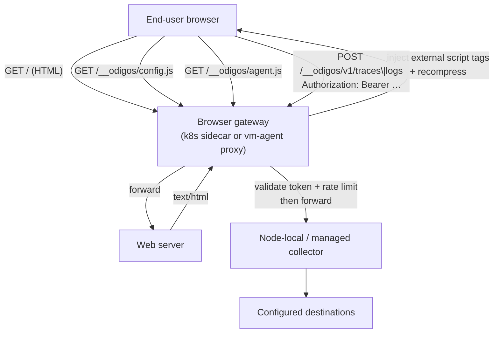

# Browser Instrumentation Architecture

This document maps the Odigos browser (RUM) instrumentation ecosystem: how the agent
bundle is produced, how it is delivered into end-user browsers, and how telemetry flows
back into Odigos collectors on Kubernetes and VMs.

## Why browser is different

Server-side Odigos agents attach to a **process** (env vars, mounts, eBPF). The browser
SDK runs in the **end-user's browser**, so there is no PID to instrument. Delivery and
collection must happen at the HTTP layer in front of the HTML-serving workload.

## Ecosystem components

| Component | Repo | Role |
| --- | --- | --- |
| `agent.js` | `odigos-io/opentelemetry-browser` | Browser OpenTelemetry SDK bundle |
| `odigos-browser-proxy` | `odigos-io/odigos` (`browser-proxy/`) | K8s sidecar: HTML inject, asset serve, hardened OTLP gateway |
| Instrumentor webhook | `odigos-io/odigos` | Injects sidecar + redirect init for `browser-community` |
| Enterprise wiring | `odigos-io/odigos-enterprise` | Distro map + odiglet agent image pin |
| `BrowserProxyController` | `odigos-io/vm-agent` | In-process reverse proxy on VMs (explicit listen/upstream) |
| UI | `odigos-io/ui-kit` | Browser language logo / selection (no security surface) |

## High-level data flow



## Delivery contract

The gateway never injects **inline** JavaScript into HTML (that breaks CSP `script-src`
without `'unsafe-inline'`). It injects only same-origin external tags:

```html
<script src="/__odigos/config.js"></script>
<script src="/__odigos/agent.js" async></script>
```

`/__odigos/config.js` is generated per gateway process and assigns `window.__ODIGOS__`
(service name, OTLP paths, resource attributes, **export token**, …). `agent.js` reads
that global and starts the SDK. See [DATA_FLOW.md](./DATA_FLOW.md) and
[SECURITY.md](./SECURITY.md).

## Platform variants

### Kubernetes

1. User sets Source `containerOverrides[].otelDistroName: browser-community`.
2. Instrumentor injects `odigos-browser-proxy` sidecar and an iptables redirect init
   container (skipped when Istio/Linkerd sidecars are present).
3. Sidecar fronts the app container port, injects scripts, serves assets, relays OTLP
   to `LocalTrafficOTLPHttpDataCollectionEndpoint`.

### VM agent

1. Operator configures a Source with `config.browser.listen` + `upstream` (explicit
   reverse-proxy mode; no iptables in Phase 1–2).
2. `BrowserProxyController` owns the listener and talks to the managed local collector.

Both platforms share the same agent bundle and the same `window.__ODIGOS__` contract.

## Opt-in only

Browser workloads are not auto-detected from `/proc`. Instrumentation is always
explicit so SSR/Node containers are not accidentally switched to the browser distro.
